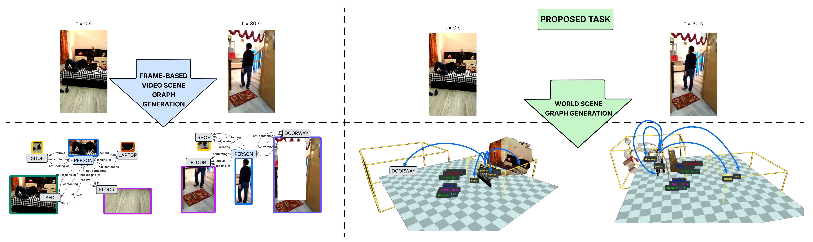

<h1 align="center">
  🌐 Towards Spatio-Temporal World Scene Graph Generation<br>from Monocular Videos
</h1>

<p align="center">
  <strong>Rohith Peddi</strong>, <strong>Saurabh</strong>, <strong>Shravan Shanmugam</strong>, <strong>Likhitha Pallapothula</strong>, <strong>Yu Xiang</strong>, <strong>Parag Singla</strong>, <strong>Vibhav Gogate</strong>
</p>

<p align="center">
  <a href="https://arxiv.org/abs/2603.13185">
    
  </a>
  &nbsp;
  <a href="mailto:rohith.peddi@utdallas.edu">
    
  </a>
  &nbsp;
  <a href="#citation">
    
  </a>
</p>

<p align="center">
  <em>📧 For access to the ActionGenome4D dataset, please email <a href="mailto:rohith.peddi@utdallas.edu">rohith.peddi@utdallas.edu</a></em>
</p>

<p align="center">
  <sub>🔄 This page is under continuous update</sub>
</p>

---

## 📢 News & Updates

- **[Jun 2026]** — Final ActionGenome4D annotations and trained model checkpoints will be released in the coming weeks alongside an updated paper.
- **[Jun 2026]** — Released the [3D BBox Annotation Tool](https://github.com/rohithpeddi/3DBBoxAnnotationTool) and the [MLLM Pipeline](https://github.com/rohithpeddi/WorldSceneGraphAnnotationTool) used for constructing ActionGenome4D annotations.
- **[May 2026]** — ActionGenome4D annotations, trained checkpoints, and VLM evaluation code available upon request by email to [rohith.peddi@utdallas.edu](mailto:rohith.peddi@utdallas.edu)
- **[Mar 2026]** — Released the [arXiv paper](https://arxiv.org/abs/2603.13185) describing the WorldSGG framework.

---

## 📋 TODO — Upcoming Releases

- [ ] ActionGenome4D dataset annotations
- [ ] Trained model checkpoints (PWG, MWAE, 4DST)
- [ ] VLM / MLLM evaluation code
- [ ] 4D scene reconstruction pipeline code

---

## 🔍 Overview

### 1. World Scene Graph Generation (WSGG) Task

<p align="center">
  
</p>

Comparison of the conventional **frame-based Video Scene Graph Generation** (left) which produces per-frame 2D scene graphs with the proposed **World Scene Graph Generation** task (right) which jointly reasons about 3D oriented bounding boxes and spatio-temporal relationships in a persistent world frame.


---

### 2. ActionGenome4D Dataset

<p align="center">
  <br>
  <sub>Animated walkthrough of the WSGG task formulation</sub>
</p>


<p align="center">
  
</p>

The **ActionGenome4D** dataset construction pipeline, showing the geometric annotation stages
(i) scene construction via π³ with bundle adjustment, 
(ii) floor determination via PromptHMR, 
(iii) 3D OBB construction via multi-scale erosion 
 alongside the semantic annotation stages
(iv) MLLM inference for relationship prediction and 
(v) custom relationship correction tool 
 with a custom 4D annotation correction tool (vi) for manual quality assurance.

<p align="center">
  <strong>Human Mesh Determination</strong><br>
  <br>
  <sub>Human mesh estimation and floor alignment for scene <code>0DJ6R</code></sub>
</p>

<p align="center">
  <strong>4D Object Reconstruction</strong><br>
  <br>
  <sub>4D static scene reconstruction with refined object masks for scene <code>0DJ6R</code></sub>
</p>

---

### 3. 4D Scene Reconstruction Pipeline

<p align="center">
  
</p>

The **4D scene reconstruction pipeline** processes raw Action Genome videos through four stages: (i) adaptive frame sampling via SIFT + RANSAC homography, (ii) feed-forward 3D inference using π³ for both static and dynamic point clouds, (iii) static-dynamic scene decomposition, and (iv) per-frame geometric alignment via Trimmed ICP with Weighted Kabsch fitting — producing a unified 4D scene representation with refined camera poses and mask-aware merging.

---

### 4. Manual Relationship Correction

The **manual relationship correction** interface allows for human-in-the-loop review and fine-grained modification of generated relationships, ensuring high-quality ground-truth annotations.

<p align="center">
  <strong>Scene Graph Corrector — Part 1</strong><br>
  <br>
  <sub>World frame relationship annotation workflow</sub>
</p>

<p align="center">
  <strong>Scene Graph Corrector — Part 2</strong><br>
  <br>
  <sub>Continued world frame relationship annotation</sub>
</p>

---

### 5. Manual 3D Annotation Correction

The **manual 3D annotation correction** tool provides a 3D annotation interface for aligning reconstructed point clouds with the ground plane. Through a multi-step process of rotation and translation adjustments, annotators correct the floor alignment to ensure accurate world-frame coordinate systems for all objects in the scene.

<p align="center">
  <strong>Monocular 3D Annotations Corrections</strong><br>
  <br>
  <sub>Correcting monocular 3D bounding box annotations</sub>
</p>

<p align="center">
  <strong>World Annotations Corrections</strong><br>
  <br>
  <sub>Correcting 3D oriented bounding box annotations in the world frame</sub>
</p>

---

### 6. Annotation Tools

The following open-source tools were developed for constructing the ActionGenome4D annotations:

| Tool | Description |
|:---|:---|
| [3D BBox Annotation Tool](https://github.com/rohithpeddi/3DBBoxAnnotationTool) | Interactive 3D bounding-box annotation and correction interface for point-cloud scenes |
| [MLLM Pipeline](https://github.com/rohithpeddi/WorldSceneGraphAnnotationTool) | Multi-modal LLM pipeline for automated relationship annotation and human-in-the-loop correction |

#### 3D BBox Pipeline — Demo Videos

<table>
  <tr>
    <td align="center"><strong>FrameBBox Annotation</strong></td>
    <td align="center"><strong>WorldBBox Annotation</strong></td>
    <td align="center"><strong>End-to-End Pipeline</strong></td>
  </tr>
  <tr>
    <td align="center">
      <video src="https://github.com/user-attachments/assets/59bdc49a-020b-45be-acca-efd16719ef14" width="300"></video>
    </td>
    <td align="center">
      <video src="https://github.com/user-attachments/assets/02e10804-5fe6-483e-a969-489eac1d80b0" width="300"></video>
    </td>
    <td align="center">
      <video src="https://github.com/user-attachments/assets/c35c9752-9eca-4eac-93dc-5cd92518f8b4" width="300"></video>
    </td>
  </tr>
</table>

---

### 7. WorldWise: WSGG Model Architecture

<p align="center">
  
</p>

The **WorldWise** architecture operates in two stages: **Stage 1** performs monocular 3D detection using DINOv3 features with a factorized 3D head to produce 2D bounding boxes, 3D OBB parameters, and class logits. **Stage 2** generates the world scene graph through four specialized encoders — object spatial encoder, object motion encoder, global structural encoder, and camera temporal encoder — followed by a masked autoencoder for unobserved object representation, and spatio-temporal decoders for relationship classification.

---

### 8. WorldRAG: MLLM Evaluation Pipeline

<p align="center">
  
</p>

The **WorldRAG** pipeline leverages Vision Language Models for unlocalized world scene graph generation. It consists of three modules: (a) a **Coarse Event Graph Construction** module that segments video into key frame segments and builds an event graph with entity, action, and scene nodes, (b) an **Object Discovery** module that identifies objects in the world using VLM-based embedding similarity matching, and (c) a **Graph RAG** module that retrieves and re-ranks relevant event graph nodes for relationship prediction via a Large Language Model.

---

## 🙏 Acknowledgements

This code builds upon the following excellent repositories. We thank all the authors for releasing their code.

| Repository | Description |
|:---|:---|
| [Pi3](https://github.com/yyfz/Pi3) | 3D object detection |
| [PromptHMR](https://github.com/yufu-wang/PromptHMR) | Human mesh recovery |
| [Cut3R](https://cut3r.github.io/) | 3D scene reconstruction |
| [RAFT](https://github.com/princeton-vl/RAFT) | Optical flow estimation |
| [DepthAnything](https://github.com/DepthAnything/Depth-Anything-V2) | Monocular depth estimation |
| [UniDepth](https://github.com/lpiccinelli-eth/UniDepth) | Universal depth estimation |

---

## <a name="citation"></a>📄 Citation

If you find this work useful in your research, please consider citing:

```bibtex
@misc{peddi2026spatiotemporalworldscenegraph,
      title={Towards Spatio-Temporal World Scene Graph Generation from Monocular Videos}, 
      author={Rohith Peddi and Saurabh and Shravan Shanmugam and Likhitha Pallapothula and Yu Xiang and Parag Singla and Vibhav Gogate},
      year={2026},
      eprint={2603.13185},
      archivePrefix={arXiv},
      primaryClass={cs.CV},
      url={https://arxiv.org/abs/2603.13185}, 
}
```
